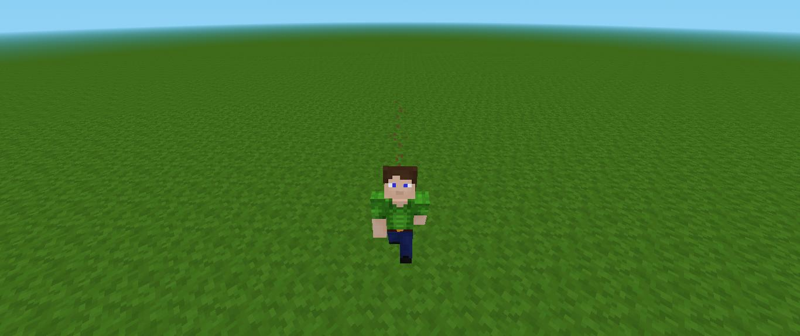

# Sprinting Mod for Minetest

Get anywhere faster by running. The sprint mechanic is something essential in open-world games like Minetest. So, here is the mod that allows just that: Sprinting. Sprint by double-tapping the forward key (usually **W**) or using Aux1 key (default **E**). When you are sprinting, you get faster, your Field of View changes and ground particles begin to appear behind you. Also, you jump a little higher.

*Example of sprinting particles and FOV effect (HeadAnim mod included).*

---

## Features
- Double-tap **W** (or forward key) or tap the Aux1 key (default **E**) to sprint.
- Adjustable speed and jump multipliers.
- Hunger/stamina drain mechanics (supports `stamina`, `hunger_ng`, and `hbhunger`).
- Support for Character Animations mod.
- FOV transitions between sprint and walk mode.
- Customizable particle effects.

---

## Requirements
- **Minetest 5.0+**
- Required Mods:
  - `default`
  - `player_api`

---

## Recommended Mods
If you want to complement the mod with a hunger(stamina) system, consider installing:
- `stamina`
- `hunger_ng`
- `hbhunger`

---

## How to Use
1. **Activation**: Double-tap the **W** key (or your configured forward key) or tap the Aux1 key (default **E**).  
2. **Effects**:
   - Speed and jump boosts while sprinting (configurable).
   - FOV increases smoothly for a "fast" feel (configurable).
   - Particles spawn underfoot (toggleable in settings).  
3. **Conditions**:
   - Requires ground contact (toggleable in settings).
   - The player is not on a ladder (toggleable in settings).
   - The player is not on a liquid such as water or lava (toggleable in settings).
   - The player is not crouching
   - Drains stamina/hunger if enabled and mods are installed (configurable).  
4. **Cancellation**: Stops automatically if:
   - You release the forward key.
   - You enter a liquid such as water or lava (toggleable in settings).
   - You climb a ladder (toggleable in settings).
   - You sneak
   - Stamina/hunger drops below thresholds (configurable).

---

## Settings  
Configure in `minetest.conf` or via the in-game "Settings" menu:  

| Setting Name                           | Type  | Default | Description                                  |
|----------------------------------------|-------|---------|----------------------------------------------|
| `sprinting_use_aux1`                   | bool  | `true`  | Use Aux1 key (default **E**) for sprinting |
| `sprinting_speed_multiplier`           | float | `1.5`   | Sprint speed multiplier |
| `sprinting_jump_multiplier`            | float | `1.10`  | Sprint jump height multiplier               |
| `sprinting_drain_stamina`              | bool  | `true`  | Enable stamina drain during sprint           |
| `sprinting_stamina_drain`              | float | `0.35`  | Stamina drain per second, from mod Stamina.                  |
| `sprinting_stamina_threshold`          | int   | `5`     | Minimum stamina, from mod Stamina, required to sprint          |
| `sprinting_hunger_ng_drain`            | float | `0.35`  | Stamina drain per second, from mod Hunger NG               |
| `sprinting_hunger_ng_threshold`        | int   | `4`     | Minimum stamina, from mod Hunger NG, required to sprint.        |
| `sprinting_hbhunger_drain`             | float | `0.85`  | Stamina drain per second, from mod HBHunger                 |
| `sprinting_hbhunger_threshold`         | int   | `6`     | Minimum stamina, from mod HBHunger, required to sprint.         |
| `sprinting_require_ground`             | bool  | `true`  | Prevents starting sprints if the player is in the air        |
| `sprinting_sprint_on_climbable`        | bool  | `true`  | Allows sprint on climbable nodes                         |
| `sprinting_sprint_in_liquids`          | bool  | `true`  | Allows sprint on liquids such as water, lava, etc                           |
| `sprinting_spawn_particles`            | bool  | `true`  | Spawn particles while sprinting          |
| `sprinting_change_fov`                 | bool  | `true`  | Change the Field Of View when the player start sprinting                  |
| `sprinting_fov_boost`                  | int   | `20`    | FOV increase during sprint                      |
| `sprinting_fov_transition_time`        | float | `0.4`   | FOV transition time                |

*Note: The "Stamina Drain" setting in hunger mods does not affect the stamina drain while running in this mod.*

---

## Acknowledgement

A small mention of those who contributed to this mod.

- @SmallJoker
- @degiel1982

---

## License  
MIT License.  
See [LICENSE.txt](LICENSE.txt) for details.  
© 2025 xXOsielXx.  